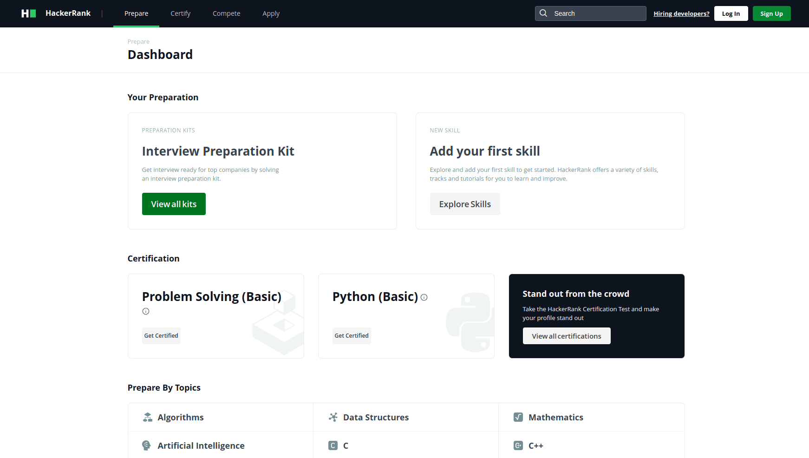
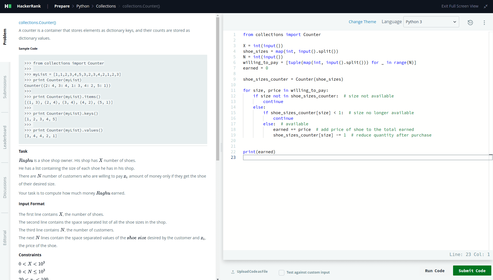

# HackerRank

HackerRank is platform where developers can hone their problem-solving skills in various domains such as Algorithms, Mathematics, Data Structures, AI, and more. 

Developers can 
- participate in coding contests, 
- practice challenges, 
- prepare for coding interview, 
- get certifications and 
- connect with tech recruiters.

___

**_This repository contains my personal solution on HackerRank Challenges:_**

### CHALLENGES:

## 1. Python
Ref: https://www.hackerrank.com/domains/python

- [x] **Introduction** (_operators, loops, if-else, function_)
- [x] **Basic Data Types** (_list, tuple, dictionary, list comprehension_)
- [x] **Strings** (_split, join, format, alignment, validators_)
- [x] **Sets** (_add, remove, union, intersection_)
- [x] **Math** (_round, divmod, math library, cmath library_)
- [x] **itertools** (_permutation, combination, groupby, product_)
- [x] **Collections** (_counter, deque, namedtuple_)
- [x] **Date and Time** (_time delta, calendar module_)
- [x] **Errors and Exceptions** (_exceptions - try, except_)
- [x] **Classes** (_built-in methods - double_underscore, overloading_)
- [x] **Built-ins** (_zipped, sort, eval, any, all_)
- [x] **Python Functionals** (_map, lambda, reduce, filter_)
- [x] **Regex and Parsing** (_re, match, findall, sub, HTMLParser_)
- [x] **XML** (_ElementTree, etree, fromstring, getroot_)
- [x] **Closures and Decorators** (_inner-func, @wrapper_)
- [ ] **Numpy**
- [ ] **Debugging**

Example:

_

## 2. Algorithms
Ref: https://www.hackerrank.com/domains/algorithms

## 3. Artificial Intelligence
Ref: https://www.hackerrank.com/domains/ai

## 4. Interview Preparation Kit
Ref: https://www.hackerrank.com/interview/preparation-kits/three-month-preparation-kit/three-month-week-one/challenges

## 5. ProjectEuler+
Ref: https://www.hackerrank.com/contests/projecteuler/challenges

